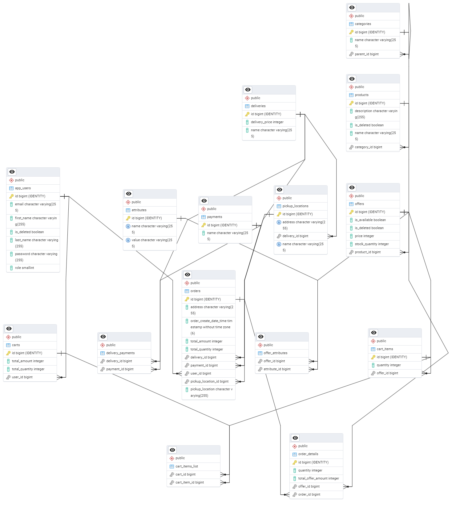

# Проект e-commerce Marketplace

## Описание

Этот проект представляет собой полноценное API для электронной коммерции для различных товаров.

## Общий обзор структуры

Товары организованы в подкатегории, где категории образуют иерархическое дерево. Каждый товар может иметь несколько предложений, а каждое предложение может иметь различные атрибуты. Предложения можно добавлять в корзину, с учетом общих количеств и цен. Когда корзина заполнена, пользователь может оформить заказ, выбрав способ доставки (курьер, самовывоз) и способ оплаты (карта, наличные). Для курьерской доставки возможна только оплата картой. Система интегрируется с DaData для валидации адресов.

После оформления заказа пользователь может просмотреть историю заказов с подробной информацией.

### Функции администратора
Администраторы могут управлять учетными записями пользователей, товарами, категориями, предложениями и атрибутами. Также они могут очищать корзины других пользователей и просматривать их историю заказов.

### Функции пользователя
Обычные пользователи могут управлять своими профилями, корзиной, оформлять заказы и просматривать историю заказов. Все остальные сущности доступны только для чтения. Регистрация и вход осуществляются с использованием электронной почты и пароля.

## Используемые технологии

- **Java 17**
- **Spring Boot** (Spring Web, Spring Data JPA, Spring Security)
- **Hibernate** (JPA)
- **Docker** (Контейнеризация и Docker Compose)
- **jUnit5** и **Mockito** (Юнит-тестирование)
- **DaData API** (Для валидации адресов)
- **Swagger** (Документация API)

## Документация Swagger

Вы можете получить доступ к документации Swagger для API, посетив [Swagger UI](http://localhost:8080/swagger-ui/index.html#/).

## Эндпоинты пользователя

- **Вход (email/пароль)**: Для аутентификации пользователя.
  - POST /auth/login
- **GET /users/me**: Получить данные текущего пользователя.
- **POST /cart/calculate**: Рассчитать общую стоимость товаров в корзине.
- **GET /deliveries**: Получить доступные способы доставки.
- **GET /payments**: Получить доступные способы оплаты.
- **POST /orders/create**: Создать новый заказ.
- **GET /orders/me**: Получить историю заказов текущего пользователя.

## Схема базы данных

## Как начать

### Docker

- Этот проект использует **Docker** и **Docker Compose** для настройки рабочей среды.
- Данные будут автоматически заполнены в базе данных при запуске контейнеров.

### Конфигурация

- Для валидации адресов необходимы токены DaData. Вы можете получить свои токены на сервисе [DaData](https://dadata.ru/) и настроить их в файле `application.yml`.

## Контакты

Если этот проект оказался полезным, поставьте звезду на GitHub!

Для обратной связи можно связаться со мной через:

- Email: [fedyanin.v.v@yandex.ru](mailto:fedyanin.v.v@yandex.ru)
- Telegram: [@fedyanin_1997](https://t.me/fedyanin_1997)

### -------------------------------------------------------------------------------------------

# E-commerce Marketplace Java Project

## Description

This project represents an API for an e-commerce marketplace platform for a variety of products.

## General Structure Overview

Products are organized in subcategories, where categories form a hierarchical tree. Each product can have multiple offers, and each offer can have various attributes. Offers can be added to the cart, with total quantities and prices calculated. When the cart is full, the user can place an order by choosing the delivery method (courier, self-pickup) and payment method (card, cash). Courier deliveries allow only card payments. The system integrates with DaData for address validation.

Once an order is placed, the user can view their order history with detailed information.

### Admin Features
Admins can manage user accounts, products, categories, offers, and attributes. They can also clear other users' carts and view their order history.

### User Features
Regular users can manage their profiles, cart, place orders, and view their order history. All other entities are read-only. Registration and login are implemented using email/password.

## Technologies Used

- **Java 17**
- **Spring Boot** (Spring Web, Spring Data JPA, Spring Security)
- **Hibernate** (JPA)
- **Docker** (Containerization and Docker Compose)
- **jUnit5** & **Mockito** (Unit testing)
- **DaData API** (For address validation)
- **Swagger** (API Documentation)

## Swagger Documentation

You can access the Swagger documentation for the API by visiting [Swagger UI](http://localhost:8080/swagger-ui/index.html#/).

## User Endpoints

- **Login (email/password)**: To authenticate a user.
    - POST /auth/login
- **GET /users/me**: Get current user details.
- **POST /cart/calculate**: Calculate the total amount of items in the cart.
- **GET /deliveries**: Get the available delivery methods.
- **GET /payments**: Get the available payment methods.
- **POST /orders/create**: Create a new order.
- **GET /orders/me**: Get the current user's order history.

## Database Schema Image

## Getting Started

### Docker

- This project uses **Docker** and **Docker Compose** to set up the development environment.
- Data will be automatically populated into the database when the containers are started.

### Configuration

- The DaData token and secret are required for address validation. You can get your tokens from the [DaData](https://dadata.ru/) service and configure them in `application.yml`.

## Contacts

If you found this project helpful, please give it a star on GitHub!

For feedback, you can reach me at:

- Email: [fedyanin.v.v@yandex.ru](mailto:fedyanin.v.v@yandex.ru)
- Telegram: [@fedyanin_1997](https://t.me/fedyanin_1997)
