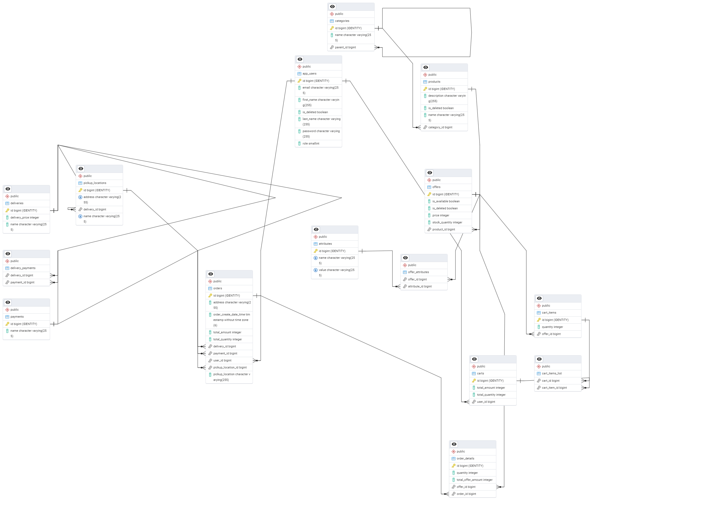

# E-commerce Marketplace Java Project

## Description

This project represents an API for an e-commerce marketplace platform for a variety of products.

## General Structure Overview

Products are organized in subcategories, where categories form a hierarchical tree. Each product can have multiple offers, and each offer can have various attributes. Offers can be added to the cart, with total quantities and prices calculated. When the cart is full, the user can place an order by choosing the delivery method (courier, self-pickup) and payment method (card, cash). Courier deliveries allow only card payments. The system integrates with DaData for address validation.

Once an order is placed, the user can view their order history with detailed information.

### Admin Features
Admins can manage user accounts, products, categories, offers, and attributes. They can also clear other users' carts and view their order history.

### User Features
Regular users can manage their profiles, cart, place orders, and view their order history. All other entities are read-only. Registration and login are implemented using email/password.

## Technologies Used

- **Java 17**
- **Spring Boot** (Spring Web, Spring Data JPA, Spring Security)
- **Hibernate** (JPA)
- **Docker** (Containerization and Docker Compose)
- **jUnit5** & **Mockito** (Unit testing)
- **DaData API** (For address validation)
- **Swagger** (API Documentation)

## Swagger Documentation

You can access the Swagger documentation for the API by visiting [Swagger UI](http://localhost:8080/swagger-ui/index.html#/).

## User Endpoints

- **Login (email/password)**: To authenticate a user.
    - POST /auth/login
- **GET /users/me**: Get current user details.
- **POST /cart/calculate**: Calculate the total amount of items in the cart.
- **GET /deliveries**: Get the available delivery methods.
- **GET /payments**: Get the available payment methods.
- **POST /orders/create**: Create a new order.
- **GET /orders/me**: Get the current user's order history.

## Database Schema Image

## Getting Started

### Docker

- This project uses **Docker** and **Docker Compose** to set up the development environment.
- Data will be automatically populated into the database when the containers are started.

### Configuration

- The DaData token and secret are required for address validation. You can get your tokens from the [DaData](https://dadata.ru/) service and configure them in `application.yml`.

## Contacts

If you found this project helpful, please give it a star on GitHub!

For feedback, you can reach me at:

- Email: [fedyanin.v.v@yandex.ru](mailto:fedyanin.v.v@yandex.ru)
- Telegram: [@fedyanin_1997](https://t.me/fedyanin_1997)